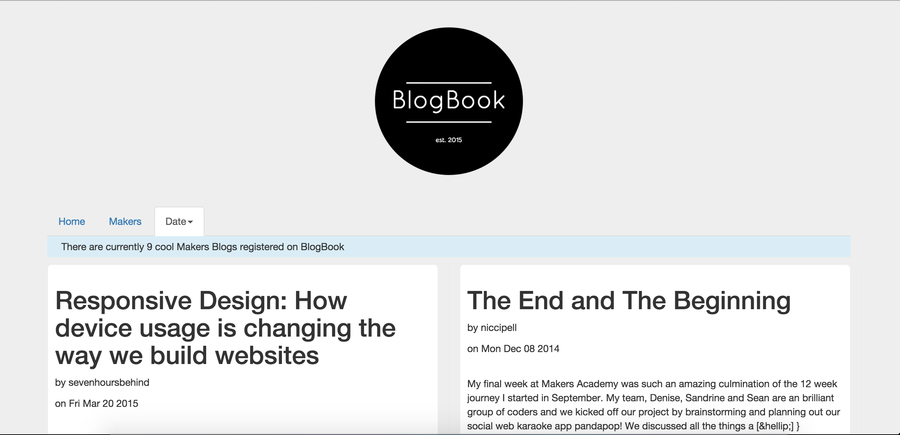
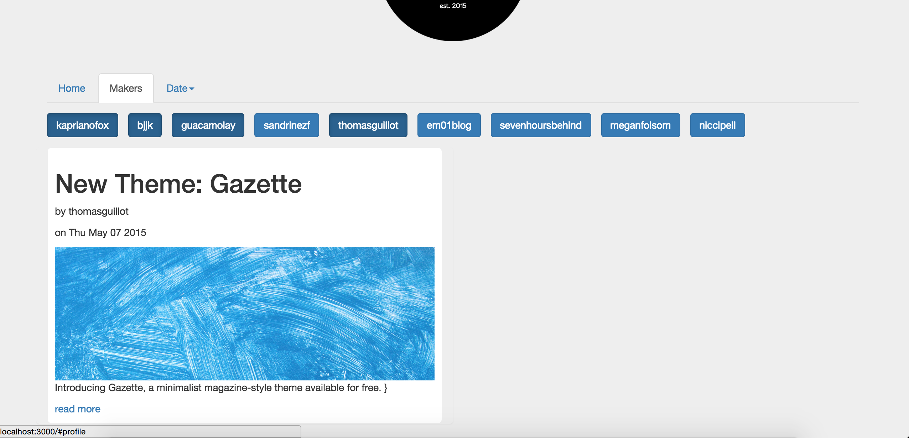

[](https://codeclimate.com/github/katebeavis/bowling-challenge)
# Blogbook

Blogbook was my first group project at Makers Academy as part of a 3 day hackerthon 'Makerthon.'

It is a single page blog aggregator written in AngularJS and run on an Express(Node.js) server. It uses the wordpress api to bring in an excerpt and featured picture from selected blogs. The blogs can filtered by date added or by author.

In terms of front-end, we decided to use Bootstrap, this being my first time using it.

## Heroku & Screenshots
###[Blogbook](https://makers-blogbook.herokuapp.com)
<div align="center">
  
</div>
<div align="center">
  
</div>


## Objectives
The main objective was to get experience of working in a team building a project from scratch. We had daily standups and used Kanban boards throughout the project.

## Todo
###Create an admin back-end
Currently blogs can only be added be hardcoding them into an Angular controller. We had two different ideas to implement adding new blogs:
- Having an 'admin' user that could login, add blogs and then store them in a database. This would be the cleanest way to do it and by adding user functionality we could expand that to users being able to add their favourite blogs to a customised feed.

- Makers Academy store students blogs on a Google spreadsheet. We could access the Google Spreadsheets api and automatically add all the blogs and any new ones that were added. I quite liked this idea as once implemented it is very simple to update and maintain.
 
###Other apis
Blogbook only brings in apis from Wordpress. As we only had 3 days we wanted to create an MVP of a working aggregator for just one blog hosting platform. The next step was to add Tumblr and Github blogs and Medium blogs via RSS feed.

## Technology
- AngularJS
- Express.js
- Javascript
- Bootstrap
- HTML
- CSS
- Karma
- Jasmine
- Phantom-JS
- Heroku

## To Run
```
$ git clone https://github.com/katebeavis/blogbook-angularjs.git
$ cd blogbook-angular
$ npm install
$ bower install
$ node server.js
visit http://localhost:3000
```

## To Run Tests
```
$ karma start
```
